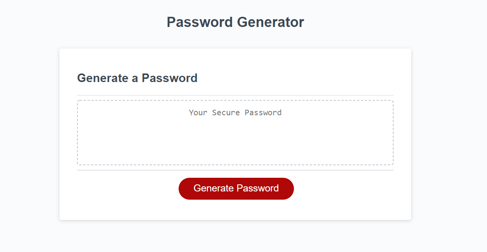

# Password Generator Refactoring

## Description

- Refactoring an application that generates a random password based on user-selected criteria.
- Users are able to choose from a variety of parameters:
  - length of password (between 8 and 128 characters)
  - Special Characters
  - Lower case letters
  - Upper case letters
  - and numbers
- After user input is chosen, a password meeting their input is displayed in the generator.

## Technologies Utilized:

- HTML
- CSS
- JavaScript

## Image of functionality:

